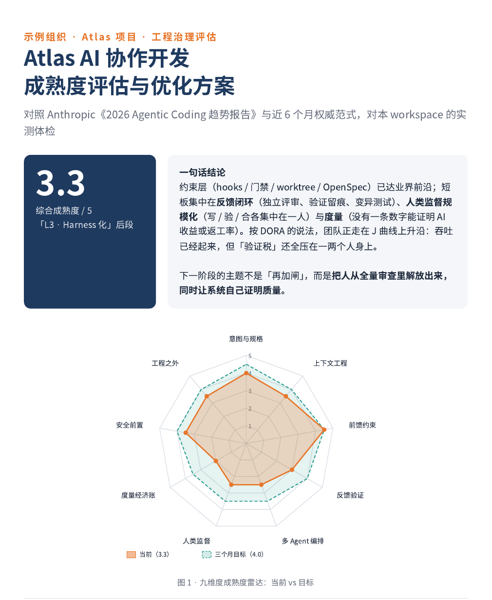
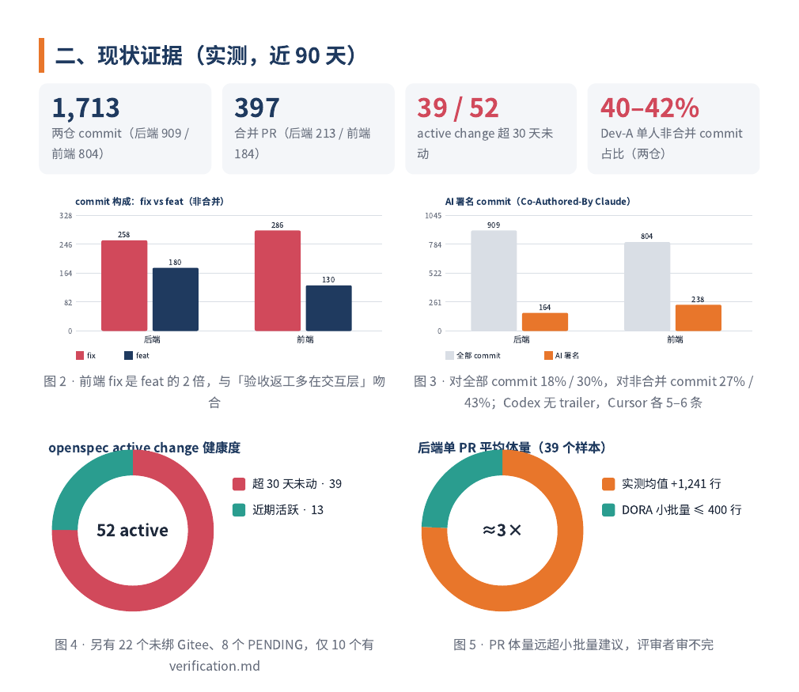
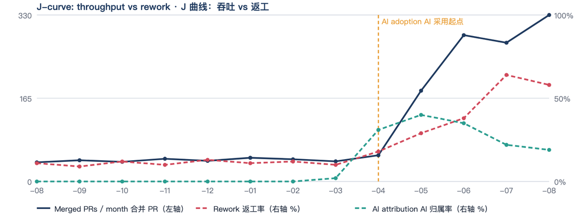
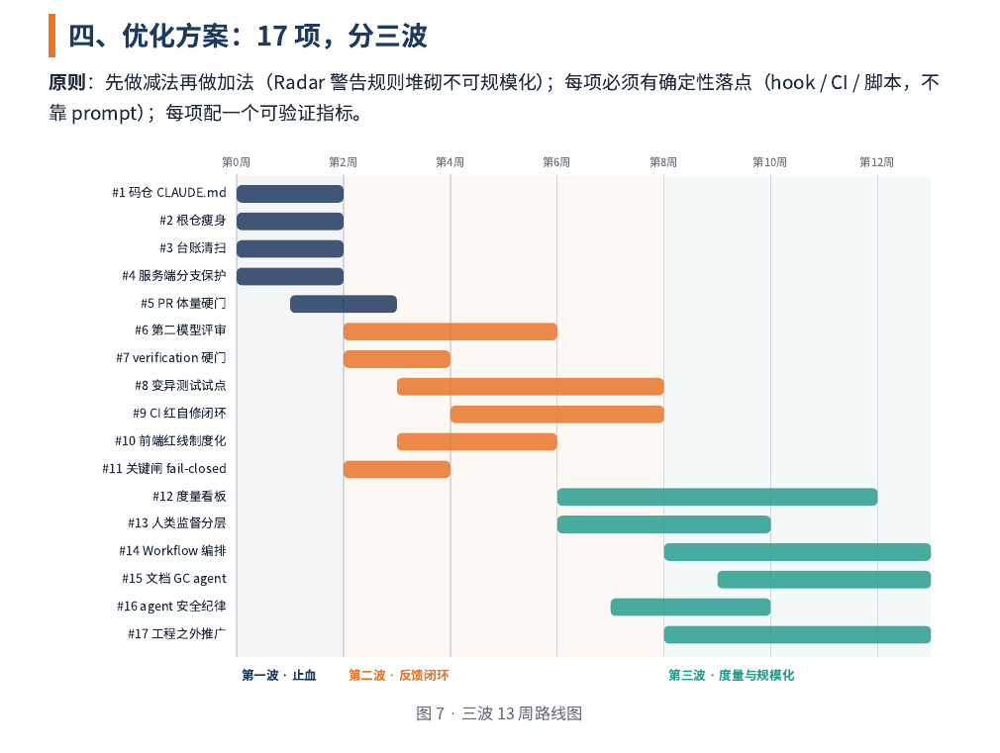

<div align="center">

# ai-dev-maturity

**How good is your team actually getting at building software with AI — and what to fix next.**

[](https://github.com/yuna78/ai_dev_maturity/actions/workflows/selftest.yml) [](LICENSE) [](https://www.python.org/) [](https://claude.com/claude-code) [](https://github.com/yuna78/ai_dev_maturity/stargazers)

   

**English** · [简体中文](README.zh-CN.md)



<sub>Sample report on synthetic data. Report language follows your input — chart and section labels are overridable via <code>labels</code> in <code>report.json</code>.</sub>

</div>

---

A [Claude Code](https://claude.com/claude-code) skill that reads your git history and agent
configuration, scores your team on **9 dimensions** against published industry research, and
produces a shareable PDF report with a concrete, landable improvement plan.

Works on **any git project** — single repo or multi-repo workspace; GitHub, GitLab, Gitee, CODING
or Bitbucket. No CI integration required, nothing uploaded anywhere: it reads your local clone.

## Why this exists

Every team adopting AI coding tools eventually asks *"are we actually good at this, or just busy?"*
The usual answers are poor ones — vendor benchmarks measure someone else's team, and "lines written
by AI" measures activity, not outcome.

This answers a narrower, more useful question: **is your way of working with AI built to survive
scale, and where will it break first?** It scores the *harness* — specs, context, gates, review,
measurement — not the people.

## What you get

| Output | Content |
|---|---|
| `scan.json` | ~40 metrics per repo: throughput, AI attribution, PR size, test ratio, CI gates, agent config, spec-layer health |
| Markdown analysis | Evidence → 9-dimension score → three-wave plan, every item with a concrete landing point and an acceptance metric |
| HTML + A4 PDF | Radar, J-curve, bars, donuts, roadmap. Print-ready, with automatic pagination self-check |
| Baseline | Stored per project, so the next run diffs against it (`--compare`) |

<div align="center">

</div>

## The J-curve — the chart most teams are missing

DORA describes AI adoption as a J-curve: things get worse before they get better, and the dip is
paid in **verification cost**. One 90-day snapshot cannot show you where you are on that curve.
`--trend 12` buckets the same git history by month so you can see it.

<div align="center">

<br><sub><i>Illustrative, synthetic data.</i></sub>
</div>

Read the two lines **together**: throughput up with rework flat is real gain; throughput up with
rework up means you are buying speed with rework, and the only question is how much of the gain
survives.

> **This is not hypothetical.** On the project this tool was first built for, the 90-day snapshot
> said *"past the bottom of the J-curve."* The 14-month view said the opposite — rework in two
> long-lived repos had gone from a 10–20% baseline to over 60%, in the same month. Same data,
> opposite conclusion, purely because of window length.

## Quickstart

```bash
git clone https://github.com/yuna78/ai_dev_maturity ~/.claude/skills/ai-collab-maturity
python3 -m playwright install chromium     # only needed for PDF rendering
```

> The clone target directory name (`ai-collab-maturity`) is the skill name Claude Code looks for —
> keep it, even though the repo is named `ai_dev_maturity`.

Then, from any git project:

```bash
S=~/.claude/skills/ai-collab-maturity/scripts

python3 $S/scan.py --root . --detect-only              # 1. sanity-check what it detected
python3 $S/scan.py --root . --trend 12 > scan.json     # 2. scan (+ monthly J-curve data)
python3 $S/build_report.py report.json --out .         # 4. render HTML + PDF
```

Step 3 — turning `scan.json` into judgement — is what the skill file is for. Open the project in
Claude Code and ask it to *assess our AI collaboration maturity*; the skill walks the model through
scoring against the rubric and drafting the report.

Comparing quarters:

```bash
python3 $S/scan.py --compare baseline-2026Q1.json scan.json
```

<div align="center">

</div>

## The 9 dimensions

Intent & specs · Context engineering · Feed-forward constraints · Feedback & verification ·
Multi-agent orchestration · Scaling human oversight · Measurement & economics · Security by default ·
Adoption beyond engineering

Scored 1–5, where **3 is the watershed**: a mechanism that exists but relies on discipline scores 3;
one enforced deterministically by a hook or CI scores 4; enforced *and* measured scores 5.
Anchors and evidence sources in [`references/maturity-rubric.md`](references/maturity-rubric.md).

Grounded in Anthropic's 2026 Agentic Coding Trends Report · DORA's *ROI of AI-assisted Software
Development* · Thoughtworks Technology Radar Vol.34 (cognitive debt) · OpenAI's harness engineering ·
Microsoft's CLI-agent rollout study · Stack Overflow Developer Survey — summarised in
[`references/paradigms-2026.md`](references/paradigms-2026.md), **with a refresh checklist, because
the summary has a shelf life.**

## What this is not

- **Not an ROI calculator.** A high score means you are likely doing it right, not that it paid off
  this quarter. How to measure returns yourself, and which metrics will mislead you:
  [`references/measuring-roi.md`](references/measuring-roi.md).
- **Not a performance review.** The report names individuals — who writes, who merges, who signs
  commits with AI. Concentration of *merge* authority is a real risk signal and anonymising it hides
  the finding. But commit share is an activity metric, and reading it as productivity is the exact
  mistake the rubric warns against. **Decide who sees the report before you run it.**
- **Not a vendor benchmark.** The only target that matters is your own previous baseline.

## Known limits

- **AI attribution is a floor, not a rate.** Only some tools leave a `Co-Authored-By` trailer. The
  scanner also mines branch names (`codex/*`) and reports both — a wide gap means a tool in use is
  invisible to the trailer count.
- **Manual checks exist.** Server-side branch protection, real tool usage, rework counts and
  non-engineering adoption cannot be read from git. `--manual manual.json` keeps those answers
  across quarters instead of losing them in a chat log.
- **Self-check the scanner's own output.** `spec.time_source_warning`, an `unlinked` count equal to
  0 or to the total, a wide `ai_by_branch` / `ai_by_tool` gap — suspiciously tidy numbers are
  usually a rule that failed to match, not reality.

## Privacy

Everything runs locally against your own clone. Nothing is uploaded, no telemetry, no network calls
except the optional Chromium download for PDF rendering.

## Requirements

`git` · `python3` 3.9+ (standard library only for scanning) · `playwright` + chromium for PDF ·
`pdf2image` optional, adds orphan-page detection to the layout self-check.

## Development

```bash
python3 scripts/selftest.py -v    # 28 assertions across 5 git platforms
```

Run it after touching any detection rule. It builds throwaway repos with GitHub / GitLab / Gitee /
CODING / Bitbucket merge conventions and asserts the scanner reads them correctly.

## License

MIT
