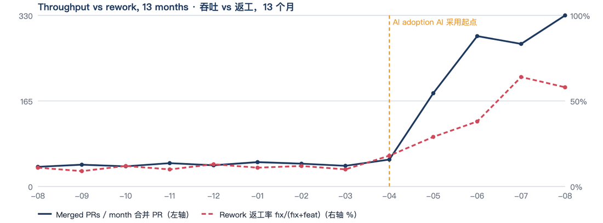

<div align="center">

# ai-dev-maturity

**你们团队用 AI 做开发，到底到了什么水平，下一步该修什么。**

[](https://github.com/yuna78/ai_dev_maturity/actions/workflows/selftest.yml) [](LICENSE) [](https://www.python.org/) [](https://claude.com/claude-code) [](https://github.com/yuna78/ai_dev_maturity/stargazers)

   

[English](README.md) · **简体中文**


<sub>样例报告，合成数据。</sub>

</div>

---

一个 [Claude Code](https://claude.com/claude-code) skill：扫描 git 历史与 agent 配置，对照公开的
行业研究按 **9 个维度**打分，产出一份能发给团队的 PDF 报告和一套落得下去的优化方案。

**任何 git 项目都能跑**——单仓或多仓 workspace，GitHub / GitLab / Gitee / CODING / Bitbucket
都支持。不需要接 CI，不上传任何东西，只读你本地的 clone。

## 为什么做这个

团队用上 AI 编码工具之后，早晚会问一句：**「我们到底是真的变强了，还是只是变忙了？」**

常见答案都不太可信——厂商报告量的是别人的团队，「AI 写了多少行代码」量的是活动量不是产出，
个人感觉则普遍高估。

本工具回答一个更窄、也更有用的问题：**你们这套跟 AI 协作的方式，撑不撑得住规模化，
以及最先会从哪里裂开。** 它打的是**协作机制**的分——规格、上下文、门禁、评审、度量——不是打人的分。

## 产出什么

| 产出 | 内容 |
|---|---|
| `scan.json` | 每仓约 40 项指标：吞吐、AI 归属、PR 体量、测试比、CI 门禁、agent 配置、规格层健康度 |
| markdown 分析 | 证据 → 九维度打分 → 三波方案，每条都有确定性落点和验收指标 |
| HTML + A4 PDF | 雷达图、趋势折线、柱状、环图、路线图，可直接打印，自带分页自检 |
| 基线 | 按项目存档，下次用 `--compare` 直接出差异 |

<div align="center">

</div>

## 一个快照会骗你

`--trend 12` 把同一份 git 历史按月分桶，让你把吞吐和返工放在一起看，而不是读一个 90 天的平均数。

<div align="center">

<p><sub><i>示意图，合成数据。</i></sub></p>
</div>

**两条线要一起读**：吞吐涨、返工平 = 真实收益；吞吐涨、返工也涨 = 在用返工换速度，
剩下的问题只是收益还剩多少。

> **这不是假设。** 本工具最早服务的那个项目，90 天快照支持一个乐观的读法；
> 14 个月的视角结论正好相反——两个有 AI 之前历史的老仓，返工率在同一个月里从 10–20% 的基线
> 冲到 60% 以上。同一份数据，只因为窗口长度不同，结论相反。

**关于「J 曲线」。** DORA 与生产率经济学文献把技术采用描述成一条 J 曲线：先变差再变好，
下沉的部分用验证成本付。它是个**有用的比喻，不是标准**——没有公认的测量方法、没有阈值、
没有可比的基准数据集。**不要把「我们在上升沿」当成一个分数去汇报。**
真要找可对标的东西，那是 **DORA 四指标**（部署频率、前置时间、变更失败率、恢复时间），
背后有十年研究和真实基准。上面这张图的价值更窄、也更可靠：**它让短窗口骗不了你。**

**返工率没有合格线。** `fix/(fix+feat)` 是**构成比**，不是质量分。维护期的成熟产品本来就该以修为主；
新项目开荒本来就该以功能为主；上线前稳定期冲高是系统在正常工作。这个数只有
**跟自己的历史比、且生命周期阶段大致可比**时才有意义——即便如此，它也只是「该去问问发生了什么」的提示，
不是判决。它还依赖提交信息规范：**看趋势之前先看有多少提交根本能被分类**，
比例本身在变的话，趋势就是假的。

## 快速上手

```bash
git clone https://github.com/yuna78/ai_dev_maturity ~/.claude/skills/ai-collab-maturity
python3 -m playwright install chromium     # 只有出 PDF 才需要
```

> clone 的目标目录名要用 `ai-collab-maturity`（Claude Code 认的 skill 名），仓名叫
> `ai_dev_maturity` 不影响。

然后在任意 git 项目里：

```bash
S=~/.claude/skills/ai-collab-maturity/scripts

python3 $S/scan.py --root . --detect-only              # 1. 先看识别对不对
python3 $S/scan.py --root . --trend 12 > scan.json     # 2. 扫描（含月度趋势数据）
python3 $S/build_report.py report.json --out .         # 4. 出 HTML + PDF
```

第 3 步——把 `scan.json` 变成判断——是 skill 文件的活。在 Claude Code 里打开项目说
「评估一下我们的 AI 协作成熟度」，它会按量表逐维打分并起草报告。

季度对比：

```bash
python3 $S/scan.py --compare baseline-2026Q1.json scan.json
```

<div align="center">

</div>

完整流程、字段说明、常见问题见 **[使用手册](docs/USAGE.zh-CN.md)**。

## 九个维度

意图与规格 · 上下文工程 · 前馈约束 · 反馈验证 · 多 Agent 编排 · 人类监督规模化 ·
度量与经济账 · 安全前置 · 工程之外的扩散

1–5 分，**3 分是分水岭**：有机制但靠自觉 = 3；hook / CI 拦得住 = 4；拦得住且有度量 = 5。
锚点与证据来源见 [`references/maturity-rubric.md`](references/maturity-rubric.md)。

参照 Anthropic《2026 Agentic Coding 趋势报告》、DORA《ROI of AI-assisted Software Development》、
Thoughtworks Technology Radar Vol.34（认知债）、OpenAI harness engineering、
Microsoft CLI Agent 推广研究、Stack Overflow 开发者调查——摘要在
[`references/paradigms-2026.md`](references/paradigms-2026.md)，**并附刷新清单，因为摘要有保质期。**

## 这不是什么

- **不是 ROI 计算器。** 分数高说明「你把事情做对的概率高」，不等于「这季度赚回来了」。
  想自己量回报、以及哪些指标会骗你，看 [`references/measuring-roi.md`](references/measuring-roi.md)。
- **不是绩效考核。** 报告会点名——谁写、谁合、谁的提交带 AI 署名。合并权集中在一个人是真实的
  风险信号，匿掉就看不见了。但 commit 占比是活动量，读成生产力正是量表反复警告的误读。
  **跑之前先想清楚这份报告给谁看。**
- **不是厂商跑分。** 唯一有意义的对照是你自己的上一次基线。

## 已知局限

- **AI 归属率是下限，不是使用率。** 只有部分工具会留 `Co-Authored-By`。脚本同时从分支名
  （`codex/*`）取证并把两个数并排给出——落差大说明有工具在用但署名统计看不见。
- **有人工核对项。** 服务端分支保护、实际用的工具、返工次数、非工程角色使用量，git 里读不到。
  `--manual manual.json` 让这些答案跨季度留存，而不是只活在一次对话里。
- **要自检脚本自己的输出。** `spec.time_source_warning`、`unlinked` 等于 0 或等于总数、
  `ai_by_branch` 与 `ai_by_tool` 落差大——**数字太整齐往往不是真的整齐，是规则没匹配上。**

## 隐私

全程在本地跑，只读你自己的 clone。不上传、无遥测，除了可选的 Chromium 下载之外没有网络请求。

## 依赖

`git` · `python3` 3.9+（扫描只用标准库）· 出 PDF 需 `playwright` + chromium ·
`pdf2image` 可选，给分页自检加上孤儿页检测。

## 开发

```bash
python3 scripts/selftest.py -v    # 28 条断言，覆盖 5 种 git 平台
```

改了任何识别规则后必跑。它会造临时仓，分别用 GitHub / GitLab / Gitee / CODING / Bitbucket
的合并约定，断言脚本读得对。

## License

MIT
